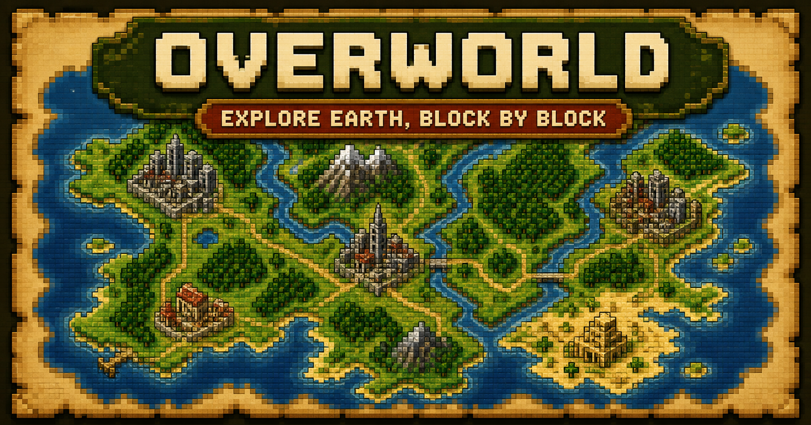
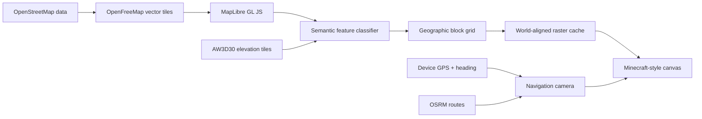

<div align="center">



# Overworld

### Explore the real world in the visual language of a Minecraft map.

[](https://overworld.earth)


[Open the map](https://overworld.earth) · [Report a bug](https://github.com/codebooker/overworld.earth/issues)

</div>

## What is Overworld?

Overworld is a real-world map and turn-by-turn navigator rendered as a block-by-block Minecraft-style map. It understands the underlying geography—water, forests, grass, sand, roads, buildings, and terrain elevation—then redraws that information through a deliberately limited palette and a custom semantic pixel renderer.

It is not a pixel filter laid over an ordinary map. The renderer classifies real map features, aligns them to a geographic block grid, applies terrain-aware shading, and caches the result as a world-aligned raster so the detail remains stable while the map pans, zooms, follows GPS, and rotates during navigation.

## Highlights

- **Minecraft-style world rendering** — semantic terrain colors, block variation, coastlines, forests, roads, buildings, and elevation shading.
- **Smooth, stable exploration** — a world-aligned detail cache prevents the underlying vector map from flashing through during movement.
- **Live GPS** — find and follow the device's current position with an accuracy indicator and directional marker.
- **Turn-by-turn driving directions** — choose a destination, calculate a route, follow maneuver cards, and receive spoken cues.
- **Navigation camera modes** — exploration stays north-up; active navigation smoothly switches to heading-up and can be paused or recentered.
- **Place-aware map card** — neighborhood names are preferred up close, with sensible city, county, state, and country fallbacks as the view zooms out.
- **Address and place search** — search the real world or drop a destination directly on the map.
- **Installable PWA** — designed for full-screen use on iPhone, iPad, Android, and desktop.
- **Mobile-first controls** — touch-friendly map tools, safe-area support, compact navigation cards, and landscape layouts.

## Try it

Visit **[overworld.earth](https://overworld.earth)** in any modern browser.

To install it like an app:

- **iPhone or iPad:** open it in Safari, tap **Share**, then **Add to Home Screen**.
- **Android:** open it in Chrome and choose **Install app** from the browser menu.
- **Desktop:** use the install icon in a supported browser's address bar.

Location tracking requires permission from the browser. The production site uses HTTPS, which allows the PWA and geolocation features to work normally.

## How the renderer works



MapLibre handles geographic projection and source data, but its vector canvas is kept hidden. Overworld queries the rendered features, assigns each block a material, adds deterministic texture and terrain shading, and paints the final scene onto its own low-resolution canvas. That canvas is enlarged with nearest-neighbor rendering to preserve sharp pixel edges.

During motion, cached blocks are transformed using geographic anchors. This lets the same detailed surface translate, scale, and rotate with the camera while replacement areas render just outside the viewport.

## Local development

### Requirements

- Node.js **22.13.0 or newer**
- npm

### Run the app

```bash
git clone https://github.com/codebooker/overworld.earth.git
cd overworld.earth
npm ci
npm run dev
```

Open the local address printed by the development server.

### Production build

```bash
npm run build
npm run start
```

No API key is required for local development. The current project uses public community map, search, terrain, and routing services.

## Project map

| Path | Purpose |
| --- | --- |
| `app/MinecraftMap.tsx` | Map setup, semantic renderer, raster cache, GPS, search, and navigation UI |
| `app/globals.css` | Pixel-art interface, responsive layouts, PWA-safe controls, and map overlays |
| `app/api/place/route.ts` | Zoom-aware reverse geocoding and neighborhood/city fallback logic |
| `app/api/route/route.ts` | Driving route proxy and turn-by-turn step retrieval |
| `public/manifest.webmanifest` | PWA identity, theme, icons, and standalone display settings |
| `worker/index.ts` | Cloudflare-compatible server entrypoint |

## Data and services

| Capability | Provider |
| --- | --- |
| Base vector data | [OpenStreetMap](https://www.openstreetmap.org/copyright) via [OpenFreeMap](https://openfreemap.org/) |
| Map engine and projection | [MapLibre GL JS](https://maplibre.org/maplibre-gl-js/docs/) |
| Place search and names | [Nominatim](https://nominatim.org/) |
| Driving routes | [OSRM](https://project-osrm.org/) |
| Elevation shading | AW3D30 © JAXA, served through MapLibre demo terrain tiles |
| Spoken directions | Browser Web Speech API and the device's installed voices |

The public Nominatim and OSRM endpoints are appropriate for a small experimental project, not unlimited production traffic. A larger deployment should use managed providers or self-hosted instances and follow each service's usage policy.

## Roadmap

- More navigation preferences and selectable speech voices
- Improved ETA, rerouting feedback, and route alternatives
- Offline or preloaded map regions for unreliable connections
- Expanded accessibility and reduced-motion behavior
- A native iOS companion using Apple's CarPlay framework and navigation entitlement—the PWA itself cannot run directly in CarPlay

## Contributing

Issues and pull requests are welcome. If you are changing the renderer, test both stationary detail and animated movement: the map should never reveal the hidden vector layer or allow cached blocks to drift away from their geographic positions.

## Disclaimer

Overworld is an independent, Minecraft-inspired fan project. It is not affiliated with or endorsed by Mojang Studios or Microsoft. Always follow posted road signs and local traffic laws; do not rely on an experimental navigation project as your only source of driving guidance.
